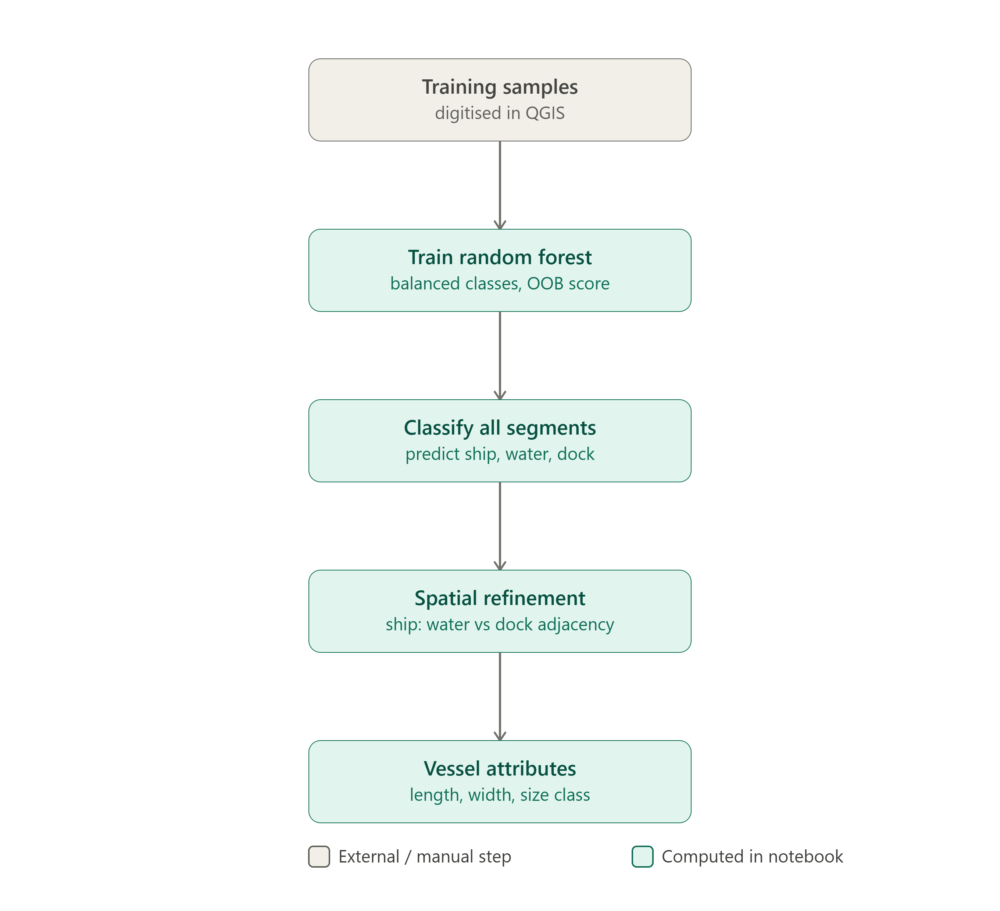
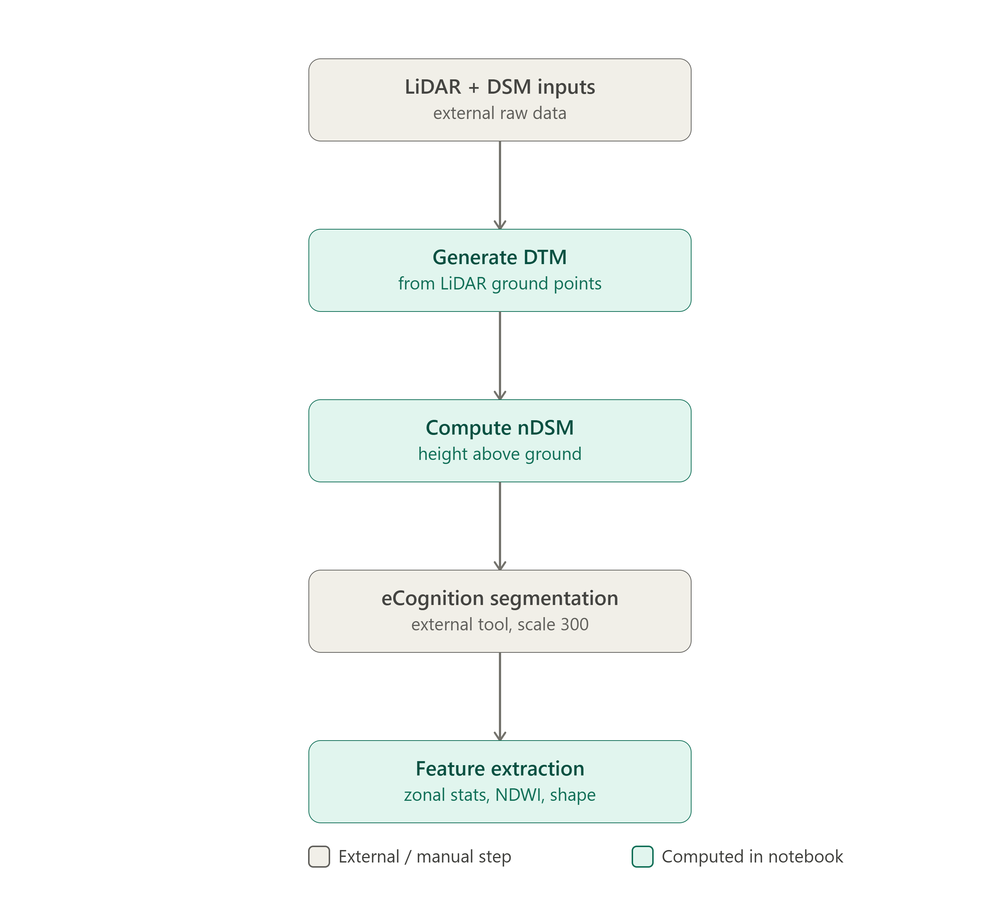
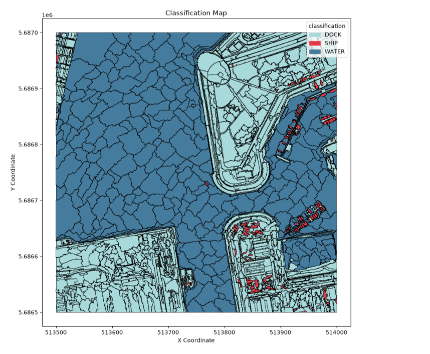
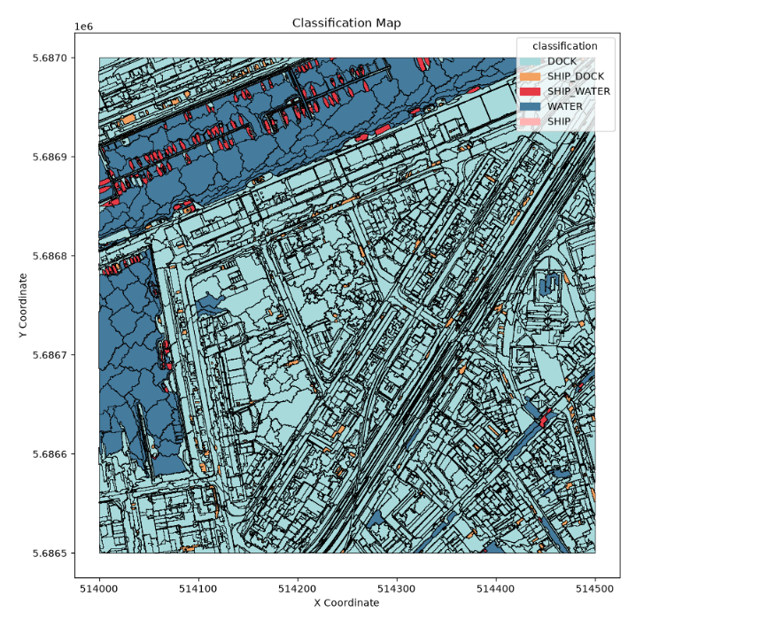

# Ship Detection in Harbor Imagery in Zeebruges, Belgium Habour, 2011

Object-based image analysis (OBIA) notebook that detects and classifies ship vessels
in RGB orthophoto + nDSM imagery using eCognition segments, a Random Forest
classifier, and spatial adjacency rules. Built with [marimo](https://marimo.io),
a reactive Python notebook (cells re-run automatically when their inputs change).

## 1. Prerequisites

- Python 3.10+
- Create a virtual environment 
```bash
    python3 -m venv julia_eo_env
```
- Activate the virtual environment 
```bash
    .\julia_eo_env\Scripts\activate
```

- Install the following packages:

```bash
pip install marimo nickyspatial rasterio scikit-learn geopandas scipy affine laspy rasterstats shapely tabulate matplotlib pandas numpy
```
- Create a folder called data_store and download the DTM,DSM,LIDAR from blackboard and place them here
```bash
    mkdir data_store
```

- **eCognition** (Trimble): used outside of the notebook to generate the segmentation
  shapefiles. This notebook does not perform that step as it took a long time to segment during the creation of the notebook. Segments were created and exported as polygon and point vector layers.
- **QGIS**: used externally to digitise training sample points
  with a `class` attribute (`SHIP` / `WATER` / `DOCK`).


The sample points GeoPackage needs a `class` column with values `SHIP`,
`WATER`, `DOCK`. I aimed for 20+ points per class especially the WATER class, as the classifier kept classifying most objects as  `WATER`.

## 2. Running the notebook

```bash
python -m marimo edit .\ship_detection_marimo.py
```

This opens an editable, reactive session in your browser allowing the execution of the cells. There is also interactivity where an upstream cell or UI control changes are done automatically.

## 3. Workflow, in order
Here's the data preparation half of the pipeline from raw inputs through to the segment feature table:



That feature table then feeds the training and classification half:


## 4. Output

`output/ships_detected.gpkg`: vessel polygons with classification, size
class, length/width/aspect ratio/orientation, mean nDSM height, and RGB band
means. Open in QGIS to preview and investigate the results.

### Tile 315135: Training Tile Classification

Segments were classified with the Random Forest classifier trained on this tile, following the full pipeline: DTM generation from LiDAR, nDSM derivation, zonal-statistic feature extraction, and manually digitised sample points for training.



### Tile 315140: Trained Model Applied to a New Tile

The same classifier (no retraining, no new sample points) was applied to a separate, previously unseen tile. DTM and nDSM were independently generated for this tile so the height feature reflects real values rather than a placeholder.



### Documentation
Project steps have been documented here:
[Project Documentation](https://docs.google.com/document/d/19-xetZzatxaulMh0Um_jrY7cc6aTfIBod_bexsPGHJw/edit?usp=sharing)


## 5. Attribution
This repository was developed as part of the Application Development (Earth Observation) class for the CDE master program.

Primary Author: Julia Wakaba

copyright © 2026 Summer Semester PLUS university